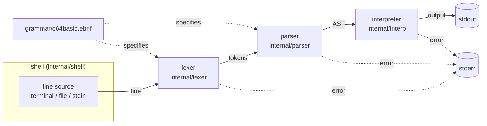

# High-Level Design: c64sh

## Problem

Commodore 64 BASIC V2 is a small language that many people learned first, and its direct mode — type a line, press RETURN, see the result — is a good interactive experience. Using it today means running a full machine emulator: a separate window, emulated keyboard and screen, and no way to pipe text in or out or write a script that behaves like any other command-line tool.

c64sh is a shell that speaks C64 BASIC V2 in an ordinary terminal. It can be run interactively like `bash` or `zsh`, or as a script interpreter (`#!/usr/bin/env c64sh`), with input from stdin and output to stdout/stderr.

## Approach

### Classic interpreter pipeline

Each input line passes through three independent stages:

1. **Lexer** — turns characters into tokens (`PRINT`, `REM` with its comment text, string literal, `;`, `,`, `+`, `:`, end of line).
2. **Parser** — turns tokens into a typed abstract syntax tree (AST).
3. **Interpreter** — walks the AST and performs its effects (writing output).

Each stage is its own Go package with its own unit tests beside the code, so each can be understood, tested, and extended on its own.

### Grammar as a written, verified spec

The language's syntax is written down in Extended Backus-Naur Form in `grammar/c64basic.ebnf`, using the notation of `golang.org/x/exp/ebnf`. The file is meant to be read by people, like a plain text reference: it opens with a notation key and each rule carries comments and examples.

The grammar is not executed. The lexer and parser are hand-written, and each parser function corresponds to one grammar rule and carries that rule as a comment. Tests keep the two aligned: the grammar must parse and verify from its start rule, and every syntactic rule must have a corresponding parse function.

### Direct mode and program mode

C64 BASIC has two ways of handling a line of input:

- **Direct mode** — a line that does not begin with a line number is executed immediately when RETURN is pressed. `PRINT "HELLO"` prints `HELLO` at once.
- **Program mode** — a line that begins with a line number (`10 PRINT "HELLO"`) is not executed. It is stored in the program, in line-number order, replacing any existing line with the same number. Stored lines execute when `RUN` is entered, and commands such as `LIST`, `NEW`, and `GOTO` operate on the stored program.

c64sh currently supports **direct mode only**. Every line, whether typed at the prompt or read from a script file or stdin, is executed immediately and independently. A line beginning with a line number is not yet accepted and fails with `?SYNTAX  ERROR`.

Program mode is a planned feature. It adds a stored program to the shell's state and a line-number prefix to the grammar's `Line` rule; the lexer → parser → interpreter pipeline is unchanged. How script files relate to program mode (for example, whether a file of numbered lines is loaded and run automatically) is decided when program mode is designed.

### Incremental language growth

The language grows one feature at a time. The language currently supports `PRINT` with string arguments and `REM` comments, in direct mode. Each new feature (numbers and math, functions such as `CHR$`, variables, program mode with line numbers, `LOAD`/`SAVE`) extends the grammar, then the lexer and parser, then the interpreter, and gets its own tests at every layer.

## Target Users

- **Retro-computing hobbyists** who know C64 BASIC and want to use it in a modern terminal without an emulator.
- **Learners** who want a small, readable language implementation to study: a documented grammar, a conventional pipeline, and tests at every stage.
- **Scripters** who want to write short C64 BASIC scripts that run as ordinary Unix commands and compose with pipes and redirection.

## Goals

- `c64sh` started from a terminal gives an interactive prompt; each line entered is executed immediately (direct mode).
- `c64sh FILE` and executable files beginning with `#!/usr/bin/env c64sh` execute each line of the file in direct mode, as if typed. Input piped on stdin is executed the same way.
- `PRINT` with string literals behaves as it does on a C64: optional space after the keyword (`PRINT"X"`), `;` and `+` join strings, and `:` separates statements on one line. `,` separates items with a tab character.
- `REM` comments behave as they do on a C64: everything after `REM` to the end of the line is ignored, including colons, so comments can document scripts and follow other statements (`PRINT "A":REM SHOW A`).
- Input the shell does not accept produces the error a C64 would print for it (for example `?SYNTAX  ERROR`).
- The lexer, parser, and interpreter each have unit tests; functional tests run the whole shell on given input and assert on captured stdout and stderr.
- `make build`, `make run`, and `make install` build the binary, build and start the shell, and install `c64sh` into `~/bin`.
- `README.md` gives a short description, build and run instructions, and one example, and links to a user guide at `docs/user-guide.md`.

## Non-Goals

- **Emulating the C64 machine.** No screen memory, 40-column wrapping, colors, cursor control, PETSCII graphics, `PEEK`/`POKE`, or timing.
- **Supporting the whole language at once.** Numbers, math, variables, functions, program mode (see *Direct mode and program mode*), and device commands are future features, added one at a time.
- **Rich interactive line editing** (history, arrow keys, tab completion). The interactive prompt reads plain lines.
- **Extensions beyond BASIC V2.** No keywords from BASIC 3.5/7.0 or third-party extensions.
- **Real device I/O.** When `LOAD`/`SAVE` are added, the storage behind them will be replaceable, so tests never touch the real filesystem.

## Tenets

- **C64 language, Unix I/O.** What the language accepts and computes follows C64 BASIC V2, including its lenient syntax (an unterminated string literal is accepted). How the program behaves as a process follows Unix conventions: errors go to stderr, failures set a non-zero exit status, and C64 screen conventions that make no sense in a terminal (such as 10-column print zones) are replaced by their terminal equivalents (a tab). The opposite choice would be to reproduce the C64 screen exactly.
- **Authentic errors over helpful ones.** When input is valid C64 BASIC that c64sh does not yet support, or is invalid, c64sh reports the error a real C64 would (`?SYNTAX  ERROR` and its siblings) rather than inventing clearer messages such as "not yet supported."

## System Design



### Components

| Component | Package | Responsibility |
|---|---|---|
| Entry point | `cmd/c64sh` | Passes the command-line arguments and the real stdin/stdout/stderr to the shell, and exits with the status it returns. |
| Shell | `internal/shell` (+ `internal/basicerr`) | Parses command-line arguments, chooses interactive or script mode, reads lines, runs each through the pipeline, and reports errors. Takes its input and output streams as parameters so it can be run inside tests. Defines the BASIC error type. |
| Grammar | `grammar` | Holds `c64basic.ebnf`, embeds it with `//go:embed`, and exposes it parsed and verified for tests in other packages. |
| Lexer | `internal/lexer` (+ `internal/token`) | Turns a line of characters into tokens. Handles C64 lexical rules such as keywords with no following space. |
| Parser | `internal/parser` (+ `internal/ast`) | Turns tokens into an AST using recursive descent, one function per grammar rule. |
| Interpreter | `internal/interp` | Executes the AST by switching on node type. Writes program output to a given writer. |

### Errors

A BASIC error (such as `SYNTAX`) is an ordinary Go error value that carries the C64 error name. Any stage can return one; the shell formats it the way a C64 prints it and writes it to stderr. An error stops the rest of the line it occurs in, as on a C64.

### Tests

- **Unit tests** live beside the code in each package (`lexer_test.go`, `parser_test.go`, …).
- **Grammar conformance tests** check that the grammar verifies and that every syntactic rule has a parse function.
- **Functional tests** in `test/functional/` run the shell in-process with given input, capture stdout and stderr, and assert on them. One test builds the real `c64sh` binary and runs a script through its `#!/usr/bin/env c64sh` line.

### Build and installation

A `Makefile` at the repository root is the single entry point for building, running, testing, and installing:

| Target | Effect |
|---|---|
| `make build` | Compiles `cmd/c64sh` to `bin/c64sh` in the repository. `bin/` is build output and is not committed. |
| `make run` | Runs `make build`, then starts `bin/c64sh`. Arguments are passed with `ARGS`, e.g. `make run ARGS=hello.bas`. |
| `make install` | Runs `make build`, then copies the binary to `$(INSTALL_DIR)/c64sh`, creating the directory if needed. `INSTALL_DIR` defaults to `~/bin` and can be overridden (`make install INSTALL_DIR=/usr/local/bin`). |
| `make test` | Runs all unit, grammar conformance, and functional tests (`go test ./...`). |
| `make clean` | Removes `bin/`. |

`make build` is the default target. For `#!/usr/bin/env c64sh` scripts and a bare `c64sh` command to work, the install directory must be on the user's `PATH`; the user guide explains this. `go install ./cmd/c64sh` also works for users who prefer Go's own tooling, but the Makefile is the documented path.

### Repository layout

```
Makefile             build, run, test, install
bin/                 build output (not committed)
cmd/c64sh/           entry point
grammar/             c64basic.ebnf and its loader
internal/basicerr/   BASIC error type (SYNTAX, …)
internal/token/      token types
internal/lexer/
internal/ast/        AST node types
internal/parser/
internal/interp/
internal/shell/
test/functional/     end-to-end tests
docs/                design docs (HLD, docs/intent/) and user-guide.md
README.md
```

## Key Design Decisions

| Decision | Chosen | Alternatives considered | Rationale |
|---|---|---|---|
| Implementation language | Go | — | Single static binary that installs with `go install`; a standard library strong enough for the whole project. |
| Pipeline | Lexer → parser → interpreter over an AST | Tokenize and interpret directly from the token stream, as the C64 ROM does | Separate stages can be tested separately, and an AST gives future features (program mode, expressions) a clean structure to extend. |
| Relation of grammar to parser | Hand-written recursive-descent parser mirroring the EBNF, kept aligned by tests | (a) Generic parser that interprets the EBNF at runtime; (b) parser generated from the EBNF at build time | `golang.org/x/exp/ebnf` only parses and verifies grammars; it does not generate parsers. A runtime grammar interpreter still needs hand-written conversion into typed AST nodes and gives poor error positions. A generator is a separate project to build and maintain, too large for BASIC V2's small grammar. Hand-written functions are readable, handle C64 lexical rules easily, and tests catch rules without a parse function. |
| Grammar file location | `grammar/c64basic.ebnf` in its own `grammar` package | Beside the parser in `internal/parser/`; in `docs/` | The grammar specifies both lexer (lowercase rules) and parser (capitalized rules), so neither package owns it. `//go:embed` cannot reach parent directories, so a small package is the simplest way for other packages' tests to load it. A top-level folder is easy to find and to link from the user guide. |
| AST evaluation | Type switch over sealed node interfaces (unexported marker methods), with a `default` case that panics | Visitor pattern | Go's type switch does the job the Visitor pattern exists for, without an `Accept`/`Visit` method pair per node type. There is a single pass over the tree (execution), so the Visitor's support for many passes buys nothing. The panicking `default` plus unit tests catch unhandled node types. |
| Build tooling | `Makefile` with `build`, `run`, `install`, `test`, `clean` | Plain `go build`/`go install` commands; a task runner such as `just` or `task` | `make` is already present on macOS and Linux, so there is nothing extra to install. Named targets give short, memorable commands that bundle steps (`run` builds first) and a user-level install location (`~/bin`, no `sudo`) that `go install`'s `$GOPATH/bin` does not match. |
| Stream handling | Shell takes `io.Reader`/`io.Writer` parameters | Shell uses `os.Stdin`/`os.Stdout` directly | Functional tests run the shell in-process and capture output, and the same seam will let future device commands use replaceable storage. |

## Success Metrics

- Every example in the user guide produces exactly the documented output when run through `c64sh`. Falsified by any documented example that does not.
- Every `PRINT` and `REM` form listed under Goals produces the same text a C64 would, with a tab in place of the C64's print zones. Falsified by any difference in functional tests.
- Every syntactic rule in `grammar/c64basic.ebnf` has a parse function. Falsified by a failing grammar conformance test.
- Adding a new statement touches only the grammar, lexer, parser, interpreter, and their tests, not the shell. Falsified if a language feature requires shell changes.

## References

- [`golang.org/x/exp/ebnf`](https://pkg.go.dev/golang.org/x/exp/ebnf): EBNF notation and verifier used for the grammar.
- *Commodore 64 Programmer's Reference Guide* (Commodore, 1982): BASIC V2 keywords, syntax, and error messages.
- [C64 BASIC V2 on C64-Wiki](https://www.c64-wiki.com/wiki/BASIC): keyword reference and behavior notes.
