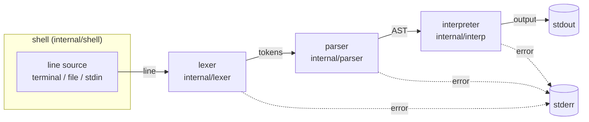

# High-Level Design: c64sh

## Problem

Commodore 64 BASIC V2 is a small language that many people learned first, and its direct mode — type a line, press RETURN, see the result — is a good interactive experience. Using it today means running a full machine emulator: a separate window, emulated keyboard and screen, and no way to pipe text in or out or write a script that behaves like any other command-line tool.

c64sh is a shell that speaks C64 BASIC V2 in an ordinary terminal. It can be run interactively like `bash` or `zsh`, or as a script interpreter (`#!/usr/bin/env c64sh`), with input from stdin and output to stdout/stderr.

## Approach

### Classic interpreter pipeline

Each input line passes through three independent stages:

1. **Lexer** — turns characters into tokens (`PRINT`, `REM` with its comment text, string literal, `;`, `,`, `+`, `:`, end of line).
2. **Parser** — turns tokens into a typed abstract syntax tree (AST).
3. **Interpreter** — walks the AST and performs its effects (writing output).

Each stage is its own Go package with its own unit tests beside the code, so each can be understood, tested, and extended on its own.

### The code defines the syntax

The syntax c64sh accepts is defined in one place: the hand-written lexer and parser. The parser is a recursive-descent parser with one function per grammar rule, and each function carries its rule, in Extended Backus-Naur Form (the notation of the Go language specification), as a comment directly above it. The lexer documents each token rule the same way. Read together, those comments are the grammar, kept beside the code that implements each rule.

The lexer and parser unit tests pin down exactly what is accepted. For users, the user guide describes the syntax in prose and `examples/features/` shows it in use.

### Direct mode and program mode

C64 BASIC has two ways of handling a line of input:

- **Direct mode** — a line that does not begin with a line number is executed immediately when RETURN is pressed. `PRINT "HELLO"` prints `HELLO` at once.
- **Program mode** — a line that begins with a line number (`10 PRINT "HELLO"`) is not executed. It is stored in the program, in line-number order, replacing any existing line with the same number. Stored lines execute when `RUN` is entered, and commands such as `LIST`, `NEW`, and `GOTO` operate on the stored program.

c64sh supports both. The shell reads a line's number the way the C64 ROM does (`$A96B`): digits, with spaces between them ignored, up to 63999. A numbered line goes to the interpreter's stored program; any other line is lexed, parsed, and executed. A stored line is lexed and parsed when it is stored, but, as in direct mode, a syntax error in it is reported only if execution reaches it: `?SYNTAX  ERROR IN 20` when line 20 runs.

**Script files follow one rule: every line behaves exactly as if typed.** Numbered lines are stored and other lines run in direct mode, in file order. A script that stored numbered lines but never started the program itself (with `RUN`, `GOTO`, or `GOSUB`) has its program run after its last line, so a file of numbered lines is an ordinary program, with no `RUN` needed:

```
30 PRINT "1"
PRINT "2"
10 PRINT "3"
PRINT "4"
40 PRINT "5"
```

prints `2` and `4` as those lines are read, then runs the program: `3`, `1`, `5`. With `RUN` as its last line it prints the same, because the script started the program itself.

### Incremental language growth

The language grows one feature at a time. The language currently supports `PRINT` with string and number arguments, arithmetic, number functions (`INT`, `RND`, `SIN`, …), string functions (`LEN`, `MID$`, `CHR$`, …), environment variables (`ENVIRON$`, `ENVIRON`, a c64sh extension), comparisons, logical operators, arrays (`DIM`), `DATA` statements (`READ`, `RESTORE`), the clock (`TI`, `TI$`), `IF … THEN`, `FOR … NEXT` loops, `GOSUB` subroutines, keyboard input (`INPUT`, `GET`), user-defined functions (`DEF FN`), variables, and `REM` comments, in direct mode and in stored programs (`RUN`, `LIST`, `NEW`, `END`, `GOTO`, `ON … GOTO`), which can be saved and loaded (`SAVE`, `LOAD`, `VERIFY`), and data files (`OPEN`, `PRINT#`, `INPUT#`, `GET#`, `CMD`, `CLOSE`, `ST`). Each new feature (`STOP` and `CONT`, screen control codes) extends the lexer and parser, with their rule comments, then the interpreter, and gets its own tests at every layer. It also adds or extends a numbered example script in `examples/features/` that exercises the feature in many ways, with a snapshot test recording that script's exact output.

## Target Users

- **Retro-computing hobbyists** who know C64 BASIC and want to use it in a modern terminal without an emulator.
- **Learners** who want a small, readable language implementation to study: a parser whose functions document their own grammar rules, a conventional pipeline, and tests at every stage.
- **Scripters** who want to write short C64 BASIC scripts that run as ordinary Unix commands and compose with pipes and redirection.

## Goals

- `c64sh` started from a terminal gives an interactive prompt; each line entered is executed immediately (direct mode). While typing a line, the up and down arrows recall earlier lines from the session, and the usual terminal editing keys work (left and right arrows, Home, End, Backspace); Ctrl-C discards the line being typed, and stops a running program with `BREAK IN n`, as the C64's STOP key does. History is saved to `~/.c64sh_history`, so earlier sessions' lines can be recalled too. (Line editing and history are c64sh extensions; a C64 has a full-screen editor instead.) In a terminal, the shell colors its own text (a c64sh extension; a C64 has no such styling): what is typed in cyan, the banner and `READY.` in green, and errors and `BREAK` in red, in the terminal's own theme colors. `NO_COLOR` turns this off, and a color a program has set stays in effect after it.
- *c64sh extension:* an interactive session first runs `~/.c64shrc`, plain c64sh BASIC lines run as if typed, like `~/.zshrc`. The shell's settings are environment variables (`NO_COLOR`, `C64SH_HISTORY`, `C64SH_HISTSIZE`, `C64SH_INPUT_COLOR`, `C64SH_READY_COLOR`, `C64SH_ERROR_COLOR`, `C64SH_STRING_LIMIT`), so the file sets them with `ENVIRON`, and they also work when c64sh is the login shell and no other shell's startup file runs. An error in the file stops it without stopping the session, and `C64SH_RC= c64sh` skips it.
- `c64sh FILE` and executable files beginning with `#!/usr/bin/env c64sh` process each line of the file as if typed: numbered lines are stored, and other lines run in direct mode. If the file stored numbered lines and never ran them with `RUN`, `GOTO`, or `GOSUB`, the program runs after the last line. Input piped on stdin is processed the same way. Ctrl-C while a script runs stops it with `BREAK` (and the line, in a program) on stderr and exit status 130, the status a Unix shell gives a command ended by Ctrl-C.
- `PRINT` with string literals behaves as it does on a C64: optional space after the keyword (`PRINT"X"`), `;` and `+` join strings, and `:` separates statements on one line. `,` moves to the next 10-column print zone, `TAB(N)` to column `N`, and `SPC(N)` right `N` columns, as on a C64; `POS(0)` gives the cursor's column.
- Numbers are written and printed as on a C64: literals such as `5`, `3.14`, `.5`, and `1E3`; printed with a leading space (or `-`) and a trailing space, rounded to 9 significant digits, with no leading zero before the decimal point (`.5`), and in scientific notation below 0.01 and from 1E9 up (`1E-03`, `1E+09`). Numbers and strings mix freely in `PRINT` (`? "5*9=";45`).
- Arithmetic follows C64 rules: `+`, `-`, `*`, `/`, and `^` (exponentiation, also typed `↑`, the same character code as the C64's up-arrow key), a leading `-` (negation) or `+`, and parentheses, with the C64's precedence (`^`, then negation, then `*` and `/`, then `+` and `-`, each left to right, so `-2^2` is -4 and `2^3^2` is 64). `+` also joins strings. Dividing by zero is `?DIVISION BY ZERO  ERROR`, a negative number to a fractional power is `?ILLEGAL QUANTITY  ERROR`, and using a string with an arithmetic operator other than joining is `?TYPE MISMATCH  ERROR`.
- Number functions work as on a C64: `ABS`, `INT` (rounding down), `SGN`, `SQR`, `LOG`, `EXP`, `SIN`, `COS`, `TAN`, `ATN` (in radians), and the constant `π`, each taking its argument in parentheses. `RND(X)` gives a pseudo-random number from 0 up to 1 with the C64's rules: a negative `X` starts a new sequence determined by `X`, a positive `X` continues the sequence, and 0 takes a number from the clock. The sequence is c64sh's own, not a C64's, and starts the same way in every run, as a C64's does after it is switched on. `FRE(X)` gives the memory left, counted as a C64 counts it, and shown as a C64 shows it, as a signed 16-bit number: negative above 32767.
- String functions work as on a C64: `LEN`, `LEFT$`, `RIGHT$`, `MID$`, `CHR$`, `ASC`, `STR$`, and `VAL`. Positions and lengths are whole numbers from 0 to 255 (`MID$` starts counting at 1), and a string's characters are counted as Unicode characters. `STR$` formats a number as `PRINT` does, without the trailing space; `VAL` reads the number a string starts with, or 0.
- Arrays work as on a C64: `DIM A(10)` makes an array of 11 numbers, `A(0)` to `A(10)`, with any number of dimensions (`DIM B$(3,4)`) for numbers, integers (`C%(…)`), and strings; an array used without `DIM` has 10 as the top of each dimension. Arrays are separate from plain variables of the same name; subscripts are rounded down; a subscript past the top is `?BAD SUBSCRIPT  ERROR`; `DIM` of an array that exists is `?REDIM'D ARRAY  ERROR`; and arrays larger than a C64's memory are `?OUT OF MEMORY  ERROR`. Arrays are cleared with the variables.
- `DATA` statements work as on a C64: `DATA` lines in a program hold values, `READ` assigns them to variables in program order (as `INPUT` reads values, quoted or not), and `RESTORE` starts again from the first. `DATA` text is not tokenized, so keywords inside it are just text. Running out is `?OUT OF DATA  ERROR`, and a value that is not a number, read into a number variable, is `?SYNTAX  ERROR` naming the `DATA` line.
- The clock works as on a C64: `TI` counts jiffies (sixtieths of a second) since c64sh started, as a C64's counts from power-on, and `TI$` shows the same clock as `HHMMSS`; assigning six digits to `TI$` sets it (`TI$="000000"`), and `TI` itself cannot be assigned. Both wrap at 24 hours.
- The C64's screen control codes work in a terminal: printing `CHR$(147)` clears the screen, `CHR$(19)` moves the cursor home, the cursor keys' codes move the cursor, the 16 color codes (`CHR$(28)` red, `CHR$(158)` yellow, …) set the text color in the C64's own colors, and `CHR$(18)`/`CHR$(146)` turn reverse video on and off, translated to the terminal's escape codes. `CHR$(13)` starts a new line. When output is not a terminal, the codes that only change the screen are left out, so files and pipes get plain text; `NO_COLOR` turns colors off.
- *c64sh extension:* programs read and set environment variables with GW-BASIC's words: `ENVIRON$("HOME")` gives a variable's value, `ENVIRON$(N)` the `N`th variable, and `ENVIRON "NAME=VALUE"` sets one (an empty value removes it), so `PATH` can be viewed and extended.
- Strings have no length limit by default, where a C64's hold at most 255 characters: environment values, program output, and network data are routinely longer. No C64 program can catch `?STRING TOO LONG` (BASIC V2 has no `ON ERROR`), so lifting the limit never changes how a working C64 program behaves. Setting `C64SH_STRING_LIMIT=255` restores the C64's limit, for programs meant to run on one.
- Comparisons behave as on a C64: `=`, `<>`, `<`, `>`, `<=`, and `>=` compare two numbers or two strings and give -1 for true and 0 for false, binding more loosely than arithmetic (`1+1=2` is -1). `=` assigns at the start of a statement and compares inside an expression, so `A=B=C` stores the comparison's result. Comparing a string with a number is `?TYPE MISMATCH  ERROR`.
- The logical operators `AND`, `OR`, and `NOT` work as on a C64: on whole numbers from -32768 to 32767, bit by bit, so that with true as -1 and false as 0 they also combine comparisons (`1<2 AND 3<4` is -1). `NOT` binds more loosely than comparisons, and `AND` more tightly than `OR`. A number outside the range is `?ILLEGAL QUANTITY  ERROR`; a string is `?TYPE MISMATCH  ERROR`.
- `IF condition THEN statements` works as on a C64: when the condition is false (0), the rest of the line is skipped, including statements after `:`, and nothing in the skipped part is checked, so even a syntax error there goes unnoticed. Any nonzero number is true, and a string is true when it is not empty. BASIC V2 has no `ELSE`.
- Variables behave as on a C64: number variables (`A`, `HEIGHT`), integer variables (`C%`, holding whole numbers from -32768 to 32767, rounding down what is stored in them), and string variables (`N$`), set with `=` with or without `LET` and used anywhere a value can go. Only the first two characters of a name count (`HEIGHT` and `HE` are the same variable), a keyword inside a name breaks it (`SCORE` contains `OR`), spaces inside a name are ignored, a variable never set is 0 or the empty string, and assigning the wrong type is `?TYPE MISMATCH  ERROR`. Values persist from line to line for the whole session or script.
- Program mode works as on a C64: a line beginning with a number from 0 to 63999 is stored in the program, in line-number order, replacing any line with that number; a number alone deletes its line. Storing or deleting a line clears the variables, as on a C64. `LIST` prints the program as the C64 does (each line as its number, a space, and its text, with `?` shown as `PRINT`), `RUN` clears the variables and runs the program from its first line, `RUN n` from line `n`, `END` stops it, and `NEW` erases it. `GOTO n` (also written `GO TO n`) continues at line `n`, in a program or typed directly, keeping the variables, and `IF condition THEN n` and `IF condition GOTO n` jump when the condition is true. An error in a running program names its line: `?SYNTAX  ERROR IN 20`. A missing line `n` is `?UNDEF'D STATEMENT  ERROR`. `LIST 100-200` (and `LIST 100`, `LIST -200`, `LIST 100-`) lists part of the program. `STOP` stops a program with `BREAK IN n`, and `CONT` continues it after `STOP`, `END`, or Ctrl-C, keeping its variables (`?CAN'T CONTINUE  ERROR` after an error or a change to the program); `CLR` clears the variables.
- `FOR` loops work as on a C64: `FOR I=1 TO 10 STEP 2` … `NEXT I` runs the statements between them with `I` counting from 1 by 2 while it does not pass 10. The loop variable is a number variable; `TO` and `STEP` (1 when omitted) are evaluated once, at `FOR`; the body always runs at least once, because the test is made at `NEXT`; and loops can nest and can be written on one line, in a program or typed directly (`FOR I=1 TO 3:PRINT I:NEXT`). `NEXT` with no variable continues the innermost loop, `NEXT I,J` closes two, and `NEXT` with no loop is `?NEXT WITHOUT FOR  ERROR`. Nesting loops more deeply than a C64's stack allows is `?OUT OF MEMORY  ERROR`.
- Subroutines work as on a C64: `GOSUB n` continues at line `n`, and `RETURN` comes back to the statement just after the `GOSUB`, even in the middle of a line or in a line typed directly. Subroutines can call subroutines; `RETURN` with no `GOSUB` to return to is `?RETURN WITHOUT GOSUB  ERROR`, and nesting more deeply than a C64's stack allows is `?OUT OF MEMORY  ERROR`. A `NEXT` cannot reach a loop begun outside the subroutine it is in, and `RETURN` ends loops begun inside the subroutine.
- Keyboard input works as on a C64, in a running program: `INPUT "NAME";N$` prints its prompt and `? `, then reads a line, splitting it at commas into the listed variables, with the C64's `?? ` prompt for more values, `?REDO FROM START` for a number it cannot read, and `?EXTRA IGNORED` for values left over. `GET K$` reads one key without waiting, and gives the empty string when no key has been pressed. Both read stdin: the terminal in an interactive session, the rest of the input when a script is piped in, and stdin when a script is a file (`c64sh quiz.bas < answers.txt`). Typed directly, they are `?ILLEGAL DIRECT  ERROR`, as on a C64.
- User-defined functions work as on a C64: `DEF FN SQ(X)=X*X+1` in a running program defines a one-line numeric function of one number, used as `FN SQ(3)` anywhere a value can go. The parameter is the function's own: the program's variable of the same name is untouched. The body's syntax is checked only when the function is called. `DEF` typed directly is `?ILLEGAL DIRECT  ERROR`, and calling a function not yet defined is `?UNDEF'D FUNCTION  ERROR`. Definitions are cleared with the variables.
- Programs are saved and loaded as on a C64, in files in the current directory: `SAVE "HELLO"` writes the program to `HELLO.bas` as text (a `#!/usr/bin/env c64sh` line, then each line as `LIST` shows it, as typed), so a saved program is also a c64sh script; `LOAD "HELLO"` replaces the program with the file's (typed directly, clearing the variables; in a running program, keeping them and running the loaded program from its start, as a C64 chains programs); `VERIFY "HELLO"` compares them (`?VERIFY  ERROR`). Device numbers work as on a C64: tape (1, the default) and disk drives (8 to 11) are the current directory, and the screen, keyboard, and printers are `?ILLEGAL DEVICE NUMBER  ERROR`. Saving to disk follows the 1541's rule that an existing file is replaced only when the name starts with `@0:`, reported, since a terminal has no drive light, as `c64sh: HELLO.bas: file exists`; saving to tape replaces it. In an interactive session, typed directly, they print the C64's messages (`SAVING HELLO`, `SEARCHING FOR HELLO`, `LOADING`).
- Data files work as on a C64: `OPEN 2,8,2,"SCORES,S,W"` opens a file by logical file number, device, secondary address, and name; `PRINT#2,…` writes to it as `PRINT` writes to the screen, `INPUT#2,…` and `GET#2,…` read it as `INPUT` and `GET` read the keyboard, `CMD 2` sends all `PRINT` output to it, and `CLOSE 2` finishes it. Tape (1) and disk drives (8 to 11) are files in the current directory, written with Unix line ends; the keyboard (0) is stdin, and the screen (3) and printers (4, 5) are stdout. `ST` reports the status of the last read: 64 at the end of a file. Opening a missing file to read is `?FILE NOT FOUND  ERROR`, and the C64's other file errors (`?FILE OPEN`, `?FILE NOT OPEN`, `?NOT INPUT FILE`, `?NOT OUTPUT FILE`, `?TOO MANY FILES`, `?FILE DATA`) are reproduced. A disk file is replaced only with `@0:`, as for `SAVE`.
- Computed jumps work as on a C64: `ON X GOTO 100,200,300` continues at the `X`th line of the list, and `ON X GOSUB …` calls it as a subroutine, whose `RETURN` comes back after the whole `ON` statement. `X` is rounded down; 0, or a number past the end of the list, continues with the next statement, and a number below 0 or above 255 is `?ILLEGAL QUANTITY  ERROR`.
- `REM` comments behave as they do on a C64: everything after `REM` to the end of the line is ignored, including colons, so comments can document scripts and follow other statements (`PRINT "A":REM SHOW A`).
- Input the shell does not accept produces the error a C64 would print for it (for example `?SYNTAX  ERROR`).
- The lexer, parser, and interpreter each have unit tests; functional tests run the whole shell on given input and assert on captured stdout and stderr.
- `examples/` holds BASIC programs for readers. `examples/features/` holds numbered, executable scripts (`001-hello-world.bas`, …) that show each language feature in many forms, commented for readers, with a `README.md` explaining how they are added and tested. Snapshot tests run every one and compare its stdout, stderr, and exit status with a recorded snapshot, so any change in behavior appears as a reviewable diff. Other directories in `examples/` (such as `examples/games/`) hold complete programs, free of those conventions and not tested, as are files directly in `examples/`.
- `make build`, `make run`, and `make install` build the binary, build and start the shell, and install `c64sh` into `~/bin`.
- A tutorial in `docs/tutorial/` teaches the language by building a text adventure, chapter by chapter, with the idioms experienced BASIC programmers used; it grows with the language, and tests run every listing in it. A companion guide, `docs/idioms.md`, collects the idiomatic patterns with the reason for each.
- `README.md` gives a short description, build and run instructions, and one example, and links to a user guide at `docs/user-guide.md`.

## Non-Goals

- **Emulating the C64 machine.** No screen memory, 40-column wrapping, PETSCII graphics, or timing. (The screen's control codes, such as colors and clearing the screen, are translated to their terminal equivalents instead; see Goals.) The keywords that work directly on the C64's memory and processor (`PEEK`, `POKE`, `SYS`, `WAIT`, and `USR`) are never supported, because each would need an emulated machine behind it: memory, the video, sound, and I/O chips, and a 6502 processor to run machine code. They stay `?SYNTAX  ERROR`.
- **Supporting the whole language at once.** Device commands are future features, added one at a time. The planned features and their order are tracked in the [roadmap issue](https://github.com/bryanesmith/c64sh/issues/34).
- **Advanced line editing**: tab completion and history search. The interactive prompt offers history and basic editing only.
- **Other BASICs.** No keywords from BASIC 3.5/7.0 or third-party extensions, except those adopted as c64sh extensions (see the tenet *BASIC V2, plus marked extensions*).
- **Real device I/O.** Tape, disk drives, and printers are not emulated: device numbers name the current directory or stdout, and the storage behind `LOAD` and `SAVE` is replaceable, so tests never touch the real filesystem. Tokenized `.prg` files, disk directories, and drive commands are future features.

## Tenets

- **C64 language, Unix I/O.** What the language accepts and computes follows C64 BASIC V2, including its lenient syntax (an unterminated string literal is accepted). How the program behaves as a process follows Unix conventions: errors go to stderr, failures set a non-zero exit status, and C64 screen conventions that make no sense in a terminal are replaced by their terminal equivalents: the cursor-right moves a C64 uses to reach a print zone become spaces. The opposite choice would be to reproduce the C64 screen exactly.
- **BASIC V2, plus marked extensions.** c64sh is Commodore 64 BASIC V2, plus a small set of extensions for living in a modern terminal: the environment, running programs, networking, and the shell's own conveniences. Every extension is marked as one wherever it is documented, so no one mistakes it for BASIC V2 or expects it on a real C64. An extension takes its name from the Microsoft BASIC lineage C64 BASIC belongs to (such as GW-BASIC's `ENVIRON$`) when one exists, and otherwise extends an existing V2 form (such as `OPEN` with a new device) before adding a keyword. The opposite choice would be to stay strictly within BASIC V2, leaving c64sh unable to serve as an everyday shell.
- **Authentic errors over helpful ones.** When input is valid C64 BASIC that c64sh does not yet support, or is invalid, c64sh reports the error a real C64 would (`?SYNTAX  ERROR` and its siblings) rather than inventing clearer messages such as "not yet supported."

## System Design



### Components

| Component | Package | Responsibility |
|---|---|---|
| Entry point | `cmd/c64sh` | Passes the command-line arguments and the real stdin/stdout/stderr to the shell, and exits with the status it returns. |
| Shell | `internal/shell` (+ `internal/basicerr`) | Parses command-line arguments, chooses interactive or script mode, reads lines, runs each through the pipeline, and reports errors. Takes its input and output streams as parameters so it can be run inside tests. Defines the BASIC error type. |
| Lexer | `internal/lexer` (+ `internal/token`) | Turns a line of characters into tokens. Handles C64 lexical rules such as keywords with no following space. |
| Parser | `internal/parser` (+ `internal/ast`) | Turns tokens into an AST using recursive descent, one function per grammar rule, each documented with its rule in EBNF. |
| Interpreter | `internal/interp` | Executes the AST by switching on node type. Writes program output to a given writer. Holds the stored program: lexes and parses each line as it is stored, and runs, lists, and erases the program. |

### Errors

A BASIC error (such as `SYNTAX`) is an ordinary Go error value that carries the C64 error name and, when it occurs in a running program, the program line's number. Any stage can return one; the shell formats it the way a C64 prints it (`?SYNTAX  ERROR`, or `?SYNTAX  ERROR IN 20` in a program) and writes it to stderr. An error stops the rest of the line it occurs in, and a running program, as on a C64.

### Tests

- **Unit tests** live beside the code in each package (`lexer_test.go`, `parser_test.go`, …).
- **Functional tests** in `test/functional/` run the shell in-process with given input, capture stdout and stderr, and assert on them. One test builds the real `c64sh` binary and runs a script through its `#!/usr/bin/env c64sh` line.
- **Tutorial tests** in `test/tutorial/` run the complete program of each tutorial chapter and project with recorded input, compare its output with a recorded snapshot, and check that the excerpts in each chapter are lines of its program.
- **Snapshot tests** in `test/snapshot/` run each script in `examples/features/` through the shell, as `c64sh FILE` does, and compare the result with a recorded snapshot in `test/snapshot/testdata/`. `make update-snapshots` rewrites the snapshots from current behavior; the resulting diff is reviewed like code. The same tests check that the examples follow their conventions (numbered names, `#!` line, a leading `REM` comment).

### Build and installation

A `Makefile` at the repository root is the single entry point for building, running, testing, and installing:

| Target | Effect |
|---|---|
| `make build` | Compiles `cmd/c64sh` to `bin/c64sh` in the repository. `bin/` is build output and is not committed. |
| `make run` | Runs `make build`, then starts `bin/c64sh`. Arguments are passed with `ARGS`, e.g. `make run ARGS=hello.bas`. |
| `make install` | Runs `make build`, then copies the binary to `$(INSTALL_DIR)/c64sh`, creating the directory if needed. `INSTALL_DIR` defaults to `~/bin` and can be overridden (`make install INSTALL_DIR=/usr/local/bin`). |
| `make test` | Runs all unit, functional, and snapshot tests (`go test ./...`), failing if any example's output differs from its snapshot. |
| `make update-snapshots` | Reruns the snapshot tests, rewriting each snapshot from the current output. |
| `make clean` | Removes `bin/`. |

`make build` is the default target. For `#!/usr/bin/env c64sh` scripts and a bare `c64sh` command to work, the install directory must be on the user's `PATH`; the user guide explains this. `go install ./cmd/c64sh` also works for users who prefer Go's own tooling, but the Makefile is the documented path.

### Repository layout

```
Makefile             build, run, test, install
bin/                 build output (not committed)
cmd/c64sh/           entry point
internal/basicerr/   BASIC error type (SYNTAX, …)
internal/token/      token types
internal/lexer/
internal/ast/        AST node types
internal/parser/
internal/interp/
internal/shell/
test/functional/     end-to-end tests
test/snapshot/       snapshot tests of examples/features/ (snapshots in testdata/)
test/tutorial/       tests of the tutorial's programs (snapshots in testdata/)
examples/            BASIC programs for readers
examples/features/   numbered feature scripts, one or more per feature
docs/                design docs (HLD, docs/intent/), user-guide.md, and tutorial/
README.md
```

## Key Design Decisions

| Decision | Chosen | Alternatives considered | Rationale |
|---|---|---|---|
| Implementation language | Go | — | Single static binary that installs with `go install`; a standard library strong enough for the whole project. |
| Extensions | Allowed, few, and marked as extensions everywhere they are documented; Microsoft BASIC names first | Strictly BASIC V2; adopt a whole later BASIC (3.5, 7.0, GW-BASIC) | A shell needs the environment, programs, and the network, which BASIC V2 has no words for. Marking keeps the V2 language recognizable; borrowing names from GW-BASIC keeps them familiar to BASIC programmers. Adopting a whole later dialect would add hundreds of keywords no shell needs. |
| Pipeline | Lexer → parser → interpreter over an AST | Tokenize and interpret directly from the token stream, as the C64 ROM does | Separate stages can be tested separately, and an AST gives future features (program mode, expressions) a clean structure to extend. |
| Where the syntax is defined | The hand-written lexer and recursive-descent parser, each rule documented in EBNF beside its implementation | (a) A separate EBNF grammar file kept aligned with the parser by conformance tests; (b) a parser that interprets an EBNF file at runtime; (c) a parser generated from an EBNF file at build time | A separate grammar file is a second description of the same syntax: conformance tests can check that its rule names match the parser, but not that the rules mean the same thing, so it invites drift and adds code. A runtime grammar interpreter still needs hand-written code per rule to build typed AST nodes, and cannot express C64 behaviors such as `REM` consuming the rest of the line or printing the items before a syntax error. A generator is a separate project, too large for BASIC V2's small grammar. |
| AST evaluation | Type switch over sealed node interfaces (unexported marker methods), with a `default` case that panics | Visitor pattern | Go's type switch does the job the Visitor pattern exists for, without an `Accept`/`Visit` method pair per node type. There is a single pass over the tree (execution), so the Visitor's support for many passes buys nothing. The panicking `default` plus unit tests catch unhandled node types. |
| Build tooling | `Makefile` with `build`, `run`, `install`, `test`, `clean` | Plain `go build`/`go install` commands; a task runner such as `just` or `task` | `make` is already present on macOS and Linux, so there is nothing extra to install. Named targets give short, memorable commands that bundle steps (`run` builds first) and a user-level install location (`~/bin`, no `sudo`) that `go install`'s `$GOPATH/bin` does not match. |
| Number representation | Go `float64`, formatted as the C64 formats numbers | Emulating the C64's 5-byte floating-point format and its arithmetic routines | Rounded to the C64's 9 significant digits, nearly every result prints identically, at a fraction of the effort. The rare last-digit differences, and C64 imprecisions such as slightly-off powers, are not reproduced. Numbers are confined to the interpreter's value type, so an exact emulation could replace `float64` later without touching other components. |
| Interactive line editing | `golang.org/x/term`'s line editor, with the terminal in raw mode only while a line is being typed | A third-party readline library (`peterh/liner`, `chzyer/readline`); a hand-written editor; no editing | `x/term` is an official Go module c64sh already uses, and it provides history and basic editing on any reader and writer, so it can be tested without a real terminal. The richer libraries add history search and completion, which are non-goals, at the cost of new dependencies. Keeping raw mode to line entry means program output, errors, and `READY.` are written exactly as before. A C64 has no command history (its screen editor re-runs any line visible on screen); history is the terminal equivalent, per the tenet *C64 language, Unix I/O*. |
| History between sessions | Saved to `~/.c64sh_history` (or `$C64SH_HISTORY`), rewritten after each line | Not saved; saved only on exit; appended line by line | Recalling earlier sessions' lines is expected of a shell. Rewriting after each line keeps the file at most 100 lines and loses nothing if c64sh is killed; saving on exit loses the session on a crash, and appending grows the file without bound. The file lives in the user's home directory, like other shells' history files, readable only by the user. |
| Scripts and program mode | Every script line behaves as if typed; a program the script stored but never ran (with `RUN`, `GOTO`, or `GOSUB`) is run after the last line | (a) Scripts run in direct mode only, so numbered lines need a `RUN` line; (b) a script whose first line is numbered is loaded as a whole program and run, other lines being errors; (c) numbered and unnumbered lines are separated, the unnumbered ones running after the program | One rule explains every script, including ones mixing numbered and direct lines, and matches typing the file at the prompt. Running a stored but never-run program at the end means a file of numbered lines works as a program without remembering `RUN`, while a script that runs its program itself (or several times) is left as written. (a) is a usability trap; (b) and (c) need rules a reader cannot see in the file. |
| Program storage | The interpreter keeps each stored line's text (for `LIST`) and its parsed tree (for running), and parses lines when they are stored | Keep only text and parse each line when it runs, as the C64 does; a separate program package | Parsing once avoids re-parsing lines that run many times, and because syntax errors are part of the tree, a line with a mistake is still reported only when it runs. The interpreter already owns execution state (variables, the column); `RUN`, `LIST`, and `NEW` act on the program, so it lives there too. |
| Program file format | Text: a `#!/usr/bin/env c64sh` line and the program's lines as typed, in `NAME.bas` | Tokenized `.prg` files, as a C64 writes them; both | Text files are readable, diffable, and runnable as c64sh scripts, and need no tokenizer. `.prg` files, for exchanging programs with emulators and real C64s, are left for later (roadmap). |
| Disk overwrite | Refuse unless the name starts with `@0:`, as a 1541 does, and say so on stderr | Always replace, as Unix tools do; refuse silently, as a C64 does | Authentic behavior, with the terminal equivalent of the drive's blinking error light: a C64 shows nothing on screen, so a silent refusal would only be discovered when the old program comes back. |
| Clock | The shell gives the interpreter its clock; tests give a fixed one | The interpreter calls `time.Now` | `RND(0)`, `TI`, and `TI$` would otherwise make snapshot tests change from run to run. |
| Configuration | Environment variables, set in `~/.c64shrc`, a file of plain BASIC | A configuration format of c64sh's own | One mechanism, nothing new to learn: the file is BASIC, and every setting can also come from the environment c64sh starts in. |
| The C64's size limits | Kept where they shape how programs are written: `OUT OF MEMORY` for nesting `FOR` and `GOSUB` too deeply and for arrays past the C64's 38911 bytes. Lifted where they only stop programs: typed lines longer than 80 characters, string length (a setting), and `FORMULA TOO COMPLEX` | Reproduce every limit; lift every limit | A deep-recursion or huge-array limit is part of how a C64 program is designed, and the error can stop a runaway program. An 80-character line or three temporary strings per expression only reject lines that would otherwise work, and no program can catch the error (BASIC V2 has no `ON ERROR`), so lifting them never changes how a working program behaves. Arrays and strings disagree (arrays stay limited by default, strings do not); arrays that large are rare, and a combined memory setting can come later if needed. |
| String length | Unlimited by default; a setting restores the C64's 255 | Always 255, as on a C64 | The only effect of the C64's limit on a working program is none, since the error cannot be caught; meanwhile it would make long environment values and program output unusable. The setting keeps the check available. |
| Shell styling | The shell's own text (typing, `READY.`, errors) in the terminal's 16 theme colors when stderr is a terminal; `NO_COLOR` turns it off | No styling, as on a C64; the C64's own colors for the shell's text | Makes a session readable at a glance: what was typed, what the program printed, and what went wrong. Theme colors suit light and dark terminals and keep the shell's text distinct from programs' C64 colors. Styling only the shell's own stderr text keeps program output and scripts' output byte-for-byte unchanged. |
| Screen control codes | Translated to terminal escape codes when stdout is a terminal, and left out otherwise | Pass them through as raw characters; emulate a 40-column screen | Translation gives real C64 programs their colors and clear screens in any modern terminal, the terminal equivalent the tenet *C64 language, Unix I/O* asks for, while files and pipes stay plain text. A screen emulation is a non-goal. |
| Keyboard input | `INPUT` and `GET` read stdin, through a console the shell gives the interpreter; at a terminal, the terminal is switched to unbuffered, unechoed input while a line runs | Read from the terminal device (`/dev/tty`) even when stdin is redirected; read only interactively | Reading stdin makes programs that ask questions scriptable (`c64sh quiz.bas < answers.txt`), and a piped script supplies its own answers on the lines that follow, exactly as if typed. Unbuffered input is what lets `GET` see a key without waiting for Return, as on a C64, while Ctrl-C keeps working. |
| Stream handling | Shell takes `io.Reader`/`io.Writer` parameters | Shell uses `os.Stdin`/`os.Stdout` directly | Functional tests run the shell in-process and capture output, and the same seam will let future device commands use replaceable storage. |

## Success Metrics

- Every example in the user guide produces exactly the documented output when run through `c64sh`. Falsified by any documented example that does not.
- Every language feature is shown in at least one script in `examples/features/`, and every script's output matches its snapshot. Falsified by a feature with no example, or a failing snapshot test.
- Every `PRINT` and `REM` form listed under Goals produces the same text a C64 would, with spaces in place of the C64's cursor-right moves. Falsified by any difference in functional tests.
- Adding a new statement touches only the lexer, parser, interpreter, their tests, and `examples/features/`, not the shell. Falsified if a language feature requires shell changes.

## References

- [The Go Programming Language Specification — Notation](https://go.dev/ref/spec#Notation): the EBNF notation used in the lexer and parser rule comments.
- *Commodore 64 Programmer's Reference Guide* (Commodore, 1982): BASIC V2 keywords, syntax, and error messages.
- [C64 BASIC V2 on C64-Wiki](https://www.c64-wiki.com/wiki/BASIC): keyword reference and behavior notes.
